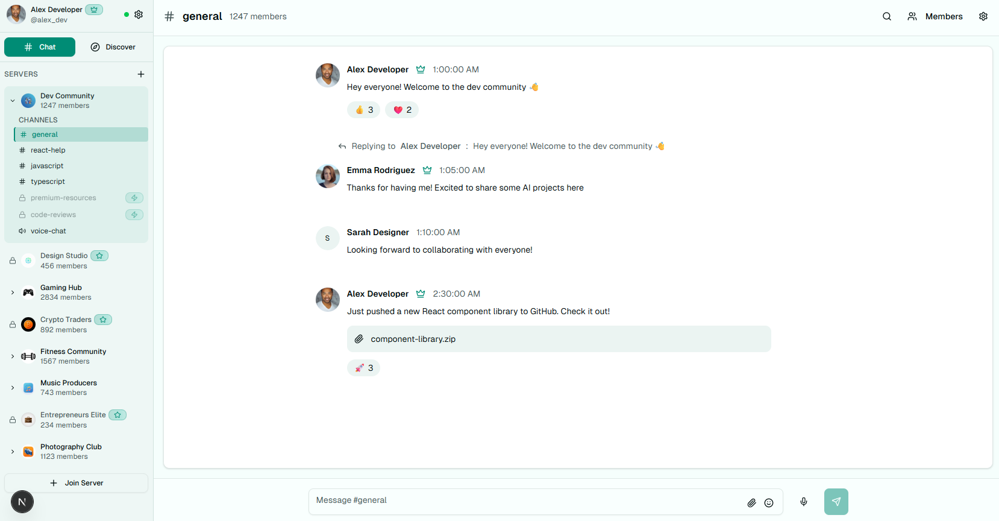

  
    
  

---

# 💬 ChatFlow – Discord-Style Social Chat Platform

## 🌟 Overview
**ChatFlow** is a modern social chat platform that merges the best of **Discord, Instagram, and Twitter** into a single seamless experience.  

This demo showcases:
- Real-time messaging
- Server & community management
- Social networking features
- Premium monetization system  

Designed for **speed, scalability, and community growth**, ChatFlow demonstrates how a full-featured platform can bring people together.

---

## 🚀 Core Features

### 💬 Real-Time Chat
- Instant text messaging (channels & DMs)  
- Emoji reactions & custom reactions  
- Threaded replies & message history  
- File sharing (images, videos, audio, docs)  
- Voice notes & audio messaging  
- Smart search across servers and channels  
- Typing indicators, edits, and deletions  

### 🏠 Server Management
- Create branded servers with custom themes  
- Join via invites or discover public servers  
- Channel organization (text & voice)  
- Role-based permissions & moderation  
- Built-in analytics for growth insights  

### 👥 Social Features
- Customizable user profiles  
- Follow system & social feed  
- Post updates with likes, shares & comments  
- Live streaming integration  
- Interactive **friend world map** 🌍  
- Presence indicators (online/offline/status)  

### 🔍 Discovery & Engagement
- Global trending posts & discussions  
- Smart server recommendations  
- Community events calendar  
- Directory of live streamers  
- Advanced search across everything  

### 👑 Premium Subscriptions
- **Free Tier**: Standard messaging & profiles  
- **Premium ($9.99/mo)**: Unlimited access, themes, support  
- **Pro ($19.99/mo)**: Server creation, analytics, API access  
- Server & channel-specific premium memberships  
- Creator-exclusive content & subscriber perks  

### 🎨 User Experience
- Sleek teal & purple modern interface  
- Responsive for mobile, tablet, desktop  
- Dark/light mode 🌗 with smooth animations  
- PWA-ready with offline support  
- Accessibility-first design  

---

## 📱 Demo User Journey

### New User
1. Create profile with avatar & bio  
2. Discover & join servers  
3. Explore channels and start chatting  
4. React, reply, and connect with others  

### Premium Flow
1. Preview locked premium content  
2. Select subscription tier  
3. Secure checkout & payment  
4. Unlock exclusive communities  

### Community Building
1. Create & brand servers  
2. Organize channels & discussions  
3. Share posts and premium content  
4. Track growth via analytics  

---

## 🎯 Featured Demo Communities
- **Dev Community**: Coding, news, and collabs  
- **Design Hub**: Feedback, resources, and showcases  
- **Gaming Central**: Tournaments & live streams  
- **Fitness & Health**: Workouts & nutrition tips  
- **Startup Network**: Pitches & networking  
- **Art Gallery**: Creative collabs & tutorials  

---

## 💰 Monetization Features
- Flexible freemium → premium upgrade model  
- Server & channel-level subscriptions  
- Revenue sharing for creators  
- Analytics dashboards for earnings & growth  

---

## 🔒 Security & Trust
- Secure authentication & payments  
- Content moderation & safety tools  
- Privacy-first user data controls  
- Transparent billing  

---

## 📊 Analytics & Insights
- Engagement & activity metrics  
- Community growth tracking  
- Content performance breakdown  
- Revenue & subscriber analytics  

---

## 🌐 Global Features
- Multi-language support  
- Timezone awareness  
- Region-specific content feeds  
- International payments & currencies  

---

  <strong>This demo brings together chat, community, and creator monetization in a single, intuitive platform.</strong>
    
  

